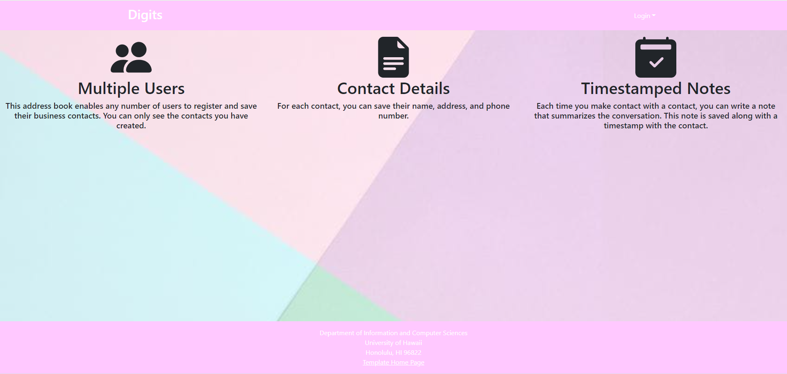
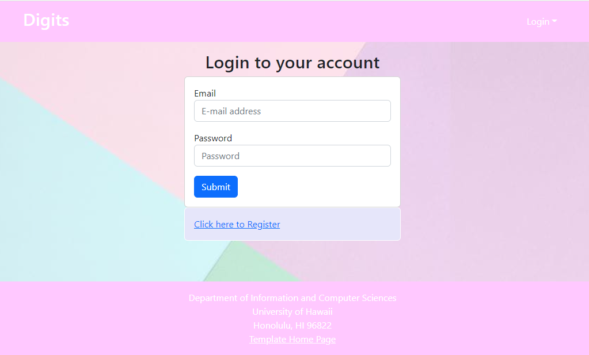
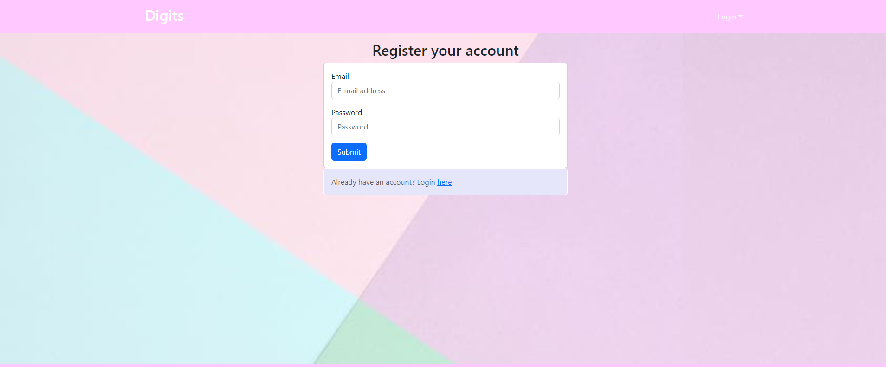
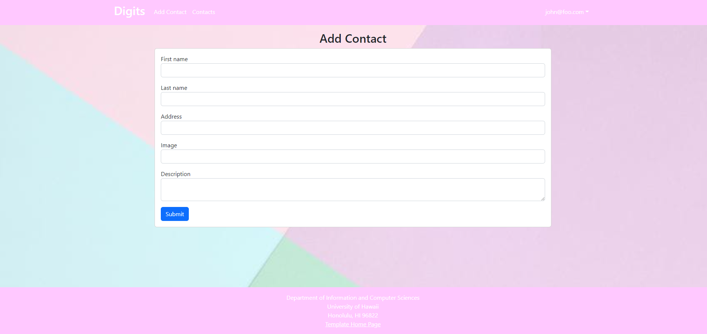
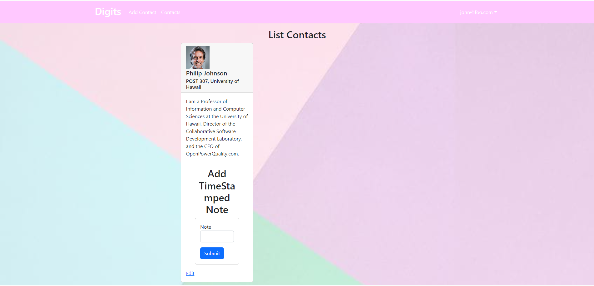

Digits is an application that allows users to:

* Register an account.
* Create and manage a set of contacts.
* Add a set of timestamped notes regarding their interactions with each contact.

## Installation

First, [install Meteor](https://www.meteor.com/install).

Second, go to [https://github.com/ics-software-engineering/meteor-application-template-react](https://github.com/ics-software-engineering/meteor-application-template-react), and click the "Use this template" button. Complete the dialog box to create a new repository that you own that is initialized with this template's files.

Third, go to your newly created repository, and click the "Clone or download" button to download your new GitHub repo to your local file system.  Using [GitHub Desktop](https://desktop.github.com/) is a great choice if you use MacOS or Windows.

Fourth, cd into the app/ directory of your local copy of the repo, and install third party libraries with:

```
$ meteor npm install
```

## Running the system

Once the libraries are installed, you can run the application by invoking the "start" script in the [package.json file](https://github.com/ics-software-engineering/meteor-application-template-react/blob/master/app/package.json):

```
$ meteor npm run start
```

The first time you run the app, it will create some default users and data. Here is the output:

```
 meteor npm run start 

> meteor-application-template-react@ start /Users/carletonmoore/GitHub/ICS314/meteor-application-template-react/app
> meteor --no-release-check --exclude-archs web.browser.legacy,web.cordova --settings ../config/settings.development.json

[[[[[ ~/GitHub/ICS314/meteor-application-template-react/app ]]]]]

=> Started proxy.                             
=> Started HMR server.                        
=> Started MongoDB.                           
I20220529-12:09:18.384(-10)? Creating the default user(s)
I20220529-12:09:18.389(-10)?   Creating user admin@foo.com.
I20220529-12:09:18.453(-10)?   Creating user john@foo.com.
I20220529-12:09:18.515(-10)? Creating default data.
I20220529-12:09:18.599(-10)?   Adding: Johnson (john@foo.com)
I20220529-12:09:18.600(-10)?   Adding: Casanova (admin@foo.com)
I20220529-12:09:18.601(-10)?   Adding: Binsted Board (admin@foo.com)
=> Started your app.

=> App running at: http://localhost:3000/
```

### Viewing the running app

If all goes well, the template application will appear at [http://localhost:3000](http://localhost:3000).  You can login using the credentials in [settings.development.json](https://github.com/ics-software-engineering/meteor-application-template-react/blob/main/config/settings.development.json), or else register a new account.

### ESLint

You can verify that the code obeys our coding standards by running ESLint over the code in the imports/ directory with:

```
meteor npm run lint
```

## User Interface Walkthrough

The following sections describe the major features of this template.

### Directory structure

The top-level directory structure is:

#### Landing page

When you retrieve the app at http://localhost:3000, this is what should be displayed:


The next step is to use the Login menu to either Login to an existing account or register a new account.

### Signin Page
When you click the login button on the right you will be taken to the sign in page where you can sign in if you have an account



### Register Page
If you do not have an account you may click the Click here to Register Button to be taken to this page to register for an account



### User Home Page
When you're logged in it is similar to the landing page but you also have new tabs on the Navigation Bar which will be to add Contacts or to view your list of Contacts


### Add Contact
In the Add Contact Pages you are given a form to add a Contact which requires a 
* First and Last Name
* Address
* Image Url
* Description



### List Contacts
In the List contacts you given a list of your contacts with their information you may
* Edit the Contact
* Add a Note


### Admin Mode

When logged into an admin account you get a new tab which allows you to see all contacts and their owners not just ones under your own account
